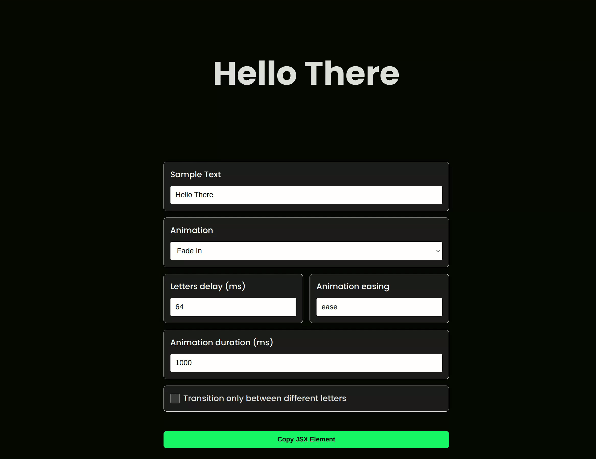

# Animated Text Letters

0 dependencies npm package to add animation to your text letters.



Access the live demo here https://lnardon.github.io/AnimatedText

## **Install**

```bash
npm install animated-text-letters
```

The package also comes with 5 animations, just import the one you'd like and pass it as the 4th argument to the function. \
They are:

- appear
- slideUp
- slideDown
- slideLeft
- slideRight

## **Usage**

```typescript
// text               : Text to be animated
// targetId           : Id of the html element where the text will be animated and appended to. (element.append())
// delay              : Amount of animation delay between letters in ms. (Optional)[Default: 0]
// animationKeyframes : @keyframes animation to be applied to the letters. (Optional)[Default: slideDown]

animateText(text:string, targetId:string, delay?:number = 0, animationKeyframes?:string);
```

HTML

```html
<div class="container">
  <div id="animated-text"></div>
</div>
```

Typescript / Javascript

```javascript
animateText("Hello World", "animated-text", 50, slideDown);
```

React: (coming soon...)
